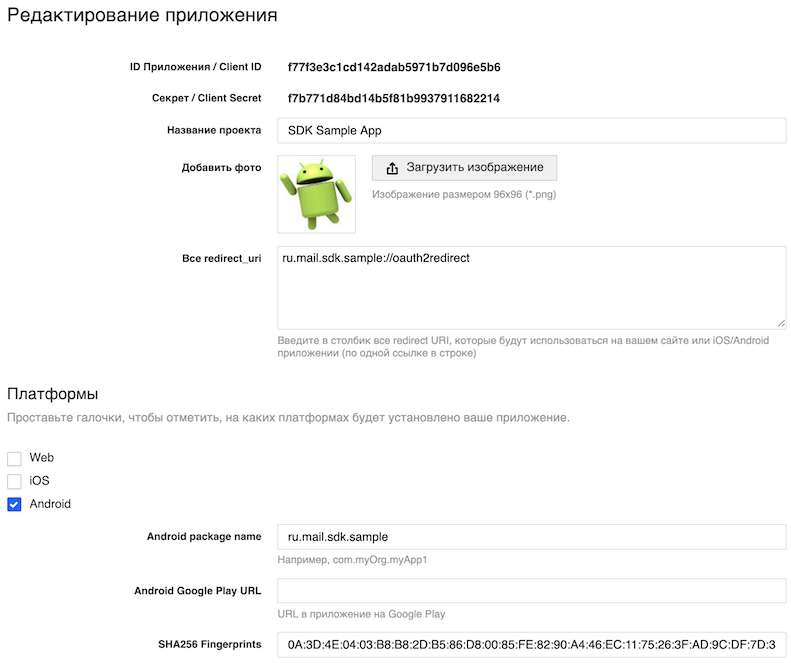

# MRAuth SDK
[  ](https://bintray.com/govorovsky/mailru/auth-sdk-pub/_latestVersion)

### Описание
MRAuth SDK — это библиотека, предназначенная для облегчения авторизации Mail.ru OAuth.
SDK поддерживает версии Android API начиная с 16 (Jelly Bean) и выше.


### Начало работы

Для использования OAuth авторизации Mail.ru необходимо [создать приложение](https://o2.mail.ru/app/). 
Сохраните полученный **ClientID и Secret приложения** и заполните обязательные поля: 
* Redirect URL
* SHA256 Fingerprint
* Android package name



Для получения SHA256 отпечатка сертификата можно использовать утилиту Keytool из состава Java SDK:

> keytool -exportcert -alias androiddebugkey -keystore path-to-debug-or-production-keystore -list -v

Нужный SHA256 отпечаток будет в строке вида:
> Certificate fingerprint: SHA256: 0A:3D:4E:03:B8:62D:B5:86:D8:55:BF:90:46:26:3F:AD:DF:7D:07:09

Так же можно использовать метод MRAuth SDK - 
```kotlin
val fingerprint = Utils.getCertificateFingerprint(context, "ru.mail.sdk.sample", Utils.DigestAlgorithm.SHA256)
```

### Подключение библиотеки к проекту

1. Добавьте зависимость в `build.gradle` вашего проекта:

    ```java
    repositories {
       jcenter()
    }
    
    dependencies {
       implementation ('ru.mail:auth-sdk-pub:10.7.0.27801')
    }
    ``` 

2. Сконфигурируйте библиотеку с необходимыми OAuth-параметрами, используя ресурсы в вашем приложении:

    ```xml
     <string name="mailru_oauth_url">https://o2.mail.ru/login</string>
     <string name="mailru_oauth_scope">userinfo</string>
     <string name="mailru_oauth_client_id">your_client_id_from_admin_panel</string>
     <string name="mailru_oauth_redirect_url">https://your_oauth_callback_from_admin_panel</string>
    ```
    
    Для обмена полученного авторизационного кода на `Access Token` рекомендуется использовать [Proof Key for Code Exchange](https://tools.ietf.org/html/rfc7636).  
    По-умолчанию SDK использует этот подход, при необходимости его можно настроить через ресурс -
    ```xml
    <bool name="mailru_code_challenge_enabled">true</bool>
    ```
    
    При желании вы можете настроить сообщения об ошибках, которые получите после завершения авторизации:
    
    ```xml
     <string name="mailru_oauth_network_error">There was a network error</string>
     <string name="mailru_oauth_user_cancelled">Operation was cancelled</string>
     <string name="mailru_oauth_user_denied">Access denied</string>
    ```
    
3. Инициализируйте SDK при запуске, используя метод `initialize`. Лучший способ — вызвать его в методе приложения `onCreate ()`:

    ```kotlin
    class SampleApplication: Application() {
        override fun onCreate() {
            super.onCreate()
            MailRuAuthSdk.initialize(this)
        }
    }
    ```
    Вы также можете указать смещение кода запроса, который будет использоваться для вызова `startActivityForResult` у SDK:

    ```kotlin
     MailRuAuthSdk.getInstance().setRequestCodeOffset(0xabcd)
    ```
    Для обработки OAuth редиректа необходимо в `build.gradle` добавить установку плейсхолдеров манифеста c хостом и схемой `Redirect URI`,  -

    ```java
    android.defaultConfig.manifestPlaceholders = [
        'MailRuOAuthRedirectHost' : 'oauth2redirect',
        'MailRuOAuthRedirectScheme' : 'com.example.app'
    ]
    ```
    
    Если необходимо изменить параметры OAuth во время выполнения (например, в целях отладки), это можно сделать в коде: 

    ```kotlin
    val authParams = OAuthParams.newInstance("https://authUrl","https://redirecturl","scope","cliendId", true)
    MailRuAuthSdk.getInstance().setOAuthParams(authParams)
    ```

4. Запуск процесса авторизации OAuth:
    Используйте MailAuthSdk API в `Activity` или `Fragment`:
    ```kotlin
        MailRuAuthSdk.getInstance().startLogin(this)
    ```
      По умолчанию результат будет возвращен в текущую Activity (см. ниже).
      
    
5. Для обработки результата авторизации и получения [Access Token](https://o2.mail.ru/docs#6-%D0%BF%D0%BE%D0%BB%D1%83%D1%87%D0%B5%D0%BD%D0%B8%D0%B5%D1%82%D0%BE%D0%BA%D0%B5%D0%BD%D0%B0) необходимо вызвать метод `handleAuthResult` в соответствующем `onActivityResult`:
    ```kotlin
    override fun onActivityResult(requestCode: Int, resultCode: Int, data: Intent?) {
        if (!MailRuAuthSdk.getInstance().handleAuthResult(
                requestCode,
                resultCode,
                data,
                SDKResultCallback()
            )
        ) {
            super.onActivityResult(requestCode, resultCode, data)
        }
    }
    ```
6. Для получения информации о пользователе используется метод `MailRuAuthSdk#requestUserInfo` :
    ```kotlin
    inner class SDKResultCallback : MailRuCallback<OAuthTokensResult, Int> {
        override fun onResult(result: OAuthTokensResult) {
            print(result.accessToken)
            MailRuAuthSdk.getInstance().requestUserInfo(result, UserInfoCallback())
        }

        override fun onError(error: Int) {
            Toast.makeText(
                applicationContext,
                OAuthRequestErrorCodes.toReadableString(error),
                Toast.LENGTH_SHORT
            ).show()
        }
    }
    ```
